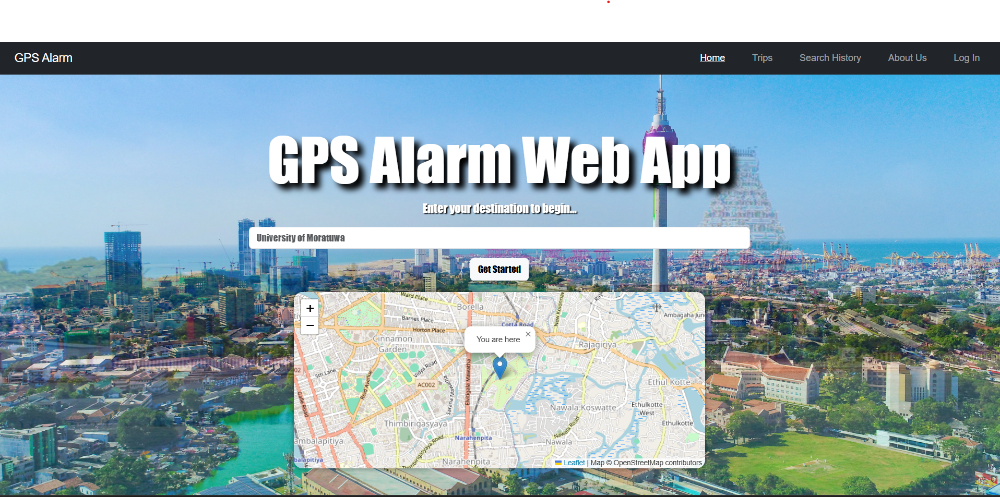
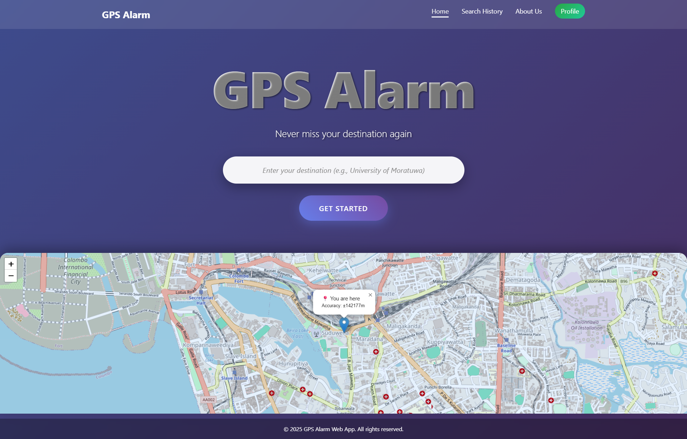

# 🗺️ GPS Alarm WebApp

**🎥 Live Demo**: [GPS Alarm Web App](https://lakathabrew.github.io/GPS_Alarm_WebApp/)

---
# Initial Home Page

# Updated Home Page

## 🔎 Overview

The **GPS Alarm WebApp** is a web-based reminder utility that helps you set location-triggered alerts. Simply enter your destination, and the app will notify you when you arrive or approach it. A handy tool for travelers, commuters, or anyone wanting an extra layer of location-based reminders.

---

## ⚙️ Features

- **Quick Setup**: Just enter your destination and set the alarm—minimal friction.
- **Trips View**: Review active or past destinations and alarms under the "Trips" section.
- **Search History**: Easily revisit previous destinations via the "Search History" tab.
- **User Accounts**: Log in to save, manage, and revisit your personalized trips.
- **About Us**: Learn more about the app’s mission and development under the “About Us” page.
- **Register**: Register for the site and experience additional.

---

## 🚩 Getting Started

1. **Visit**: Go to [GPS Alarm Web App](https://lakathabrew.github.io/GPS_Alarm_WebApp/).
2. **Log IN**: Enter your username or email and password to Log In to your account.
3. **Register**: If you have not registered yet, click sign-up to go to the Register Page.
4. **Enter Destination**: Type in the place and set your preferred alarm.
5. **Track & Alert**: The app monitors your location and delivers an alert when you reach the target.
6. **Manage Trips**: Navigate your “Trips” and “Search History” to revisit or modify past alerts.

---

## 💡 Usage Tips

- Ensure your browser or device permissions allow location tracking and send mobile notifications.
- Refresh the page if location permissions and notification permissions were changed.
- Save important trips with an account for easier future access.

---

## ⚠️ Troubleshooting

| Issue | Resolution |
|-------|------------|
| Alarm doesn’t trigger | Verify you granted location permissions and your browser supports geolocation. |
| Notifications don't come | Verify you granted send notifications permissions |
| Location tracking issues | Switch to a modern browser or check your device’s GPS settings. |
| Login errors | Refresh the page or confirm your credentials are correct. |

---

## 📈 Future Improvements

- Add support for custom alarm radius and entry/exit triggers.
- Integrate audio or visual alert options.
- Implement offline functionality for areas with poor connectivity.
- Enable linking to external apps or documents from trip entries.

---

## 🤝 Contributing

Contributions welcome! Feel free to:

- Fork the repo
- Create a feature branch
- Submit a pull request with improvements or bug fixes

---

## 🧾 License

This project is open-source. Please include your preferred license here (e.g., MIT, Apache 2.0).

---

## ✍️ Credits

Created and maintained by **Lakmana Thabrew**. View more on the **About Us** page of the app.

